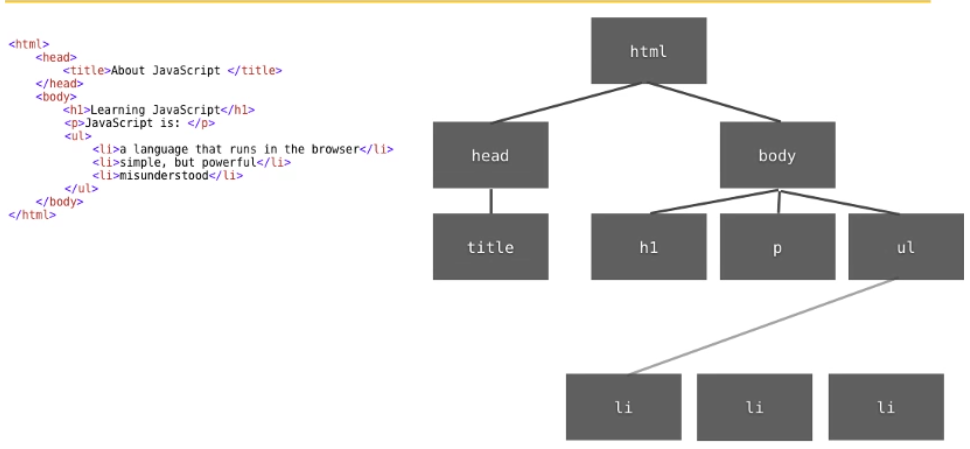

##Javascript
* Adding javascript to page
`<script>document.write("<p>Hello</p>")</script>`
or `<script src = "js/myscript.js"></script>`
* Comments `//` or `/* ... */`
* `==` sign compares equality of values of two variables and also return true even if they have different types.
* Unlike two equal sign, `===` compares equality of types and values of two variables.
* putting `;` at the end of statements is not required but suggested.
* `var` is also not required when defining variables but sugg ested.

* **Type Casting**
    * String > Number `Number("85")`
    * Number > String `String(85)` or `85 + ""`
* Fetching element from html by id `document.getElementById("id")`
* If,else,for,while statements are same with php and  ...
* **Functions**
    all arguments of function stored in an array called `arguments`
   
```javascript
function func_name(var1,var2..){
... 
var1= 3 * var2;
arguments[1]
arguments[2]
arguments.length();//returns how many arguments passed.
return var1;
}

func_name(1,5,7); // == func_name(1,5); extra parameters will be ignored    

```
* **Arrays**
    * Defining `var my_array = []` or `var my_array = [4,7,12]`
    * Getting length `my_array.length()`
    * Arrays grows dynamicly.
    * `my_array.push("elmnt")` adds "elmnt" item to end of the array.
    * `my_array.pop()` retuns and deletes last element of array.
    * `my_array.unshift("elmnt")` adds one or more elements to the beginning of the array.
    * `my_array.shift()` removes and returns first element then shifts array to thet blank field.
    * `my_array.concat(array2)` returns concatanated form of two arrays.(arrayarray2)
    * `delete my_array[5]` removes element in 5th index (actually mak that index undefined.) 
    * `my_array.reverse()` just reverses array.
    * Slice
    	* `my_array.slice(2, 7)` returns elements from index 2 to 7 in array. 
    	* `my_array.slice(2)` means from 2 to last
    	* `my_array.slice(2, -3)` from 2 to, 3 before last index
    *  example   
    	`var allURLsinPage = document.getElementByTagName("a");`

* **Strings**
	
	```javascript
	var phrase = "This is simple phrase.";`
	var words phrase.spit(" "); //words[0] -> This ...
	var position = phrase.indexOf("simple"); //returns 9 (returns -1 when not found)
	```

* **DATE and TIME**
   
	```javascript
	var today = new Date(); //current date
	var timeOfSth = Date(2000,0,1) //1 Jan 2000 (!!! month is from 0 to 11)
	today.getMonth(); // returns 0..11
	today.getFullYear(); //2016
	today.getDate(); //returns the day of month (1-31)
	today.getDay(); //returns 0-6 day of the week
	today.getHours(); // 0-23
	today.setMonth(5); //etc.
	```

* **OBJECTS**
	* creating...
	```javascript
	var player = newObject();
	player.name = "Ali";
	player.score = 10000;
	player.rank = 1;
	
	//or

	var player1 = { name:"Ali", score: 10000, rank: 1 };
	```
   
* **DOM (Document Object Model)**
	* Document is the html file where js file called.
	* Model 
	
	* Node is every element that has id.
	* You can get element with `document.getElementById("idname")`
	* You can get same tags with `document.getElementsByTagName("p")`
	* Let `ul` tag above has id of "abc"    
		```javascript
		var myList = document.getElementById("abc");
		var myAllListItems = document.getElementsByTagName("li"); //returns array contains all "li" tags in document
		var myListItems = myList.getElementsByTagName("li"); //returns array contains all "li" tags in ul tag has id of "abc"
		a = myList.nodeType; //returns type of node
		b = myList.innerHTML; //retuns html code of that node
		c = myList.childNodes.length; //retuns how many child nodes that node have
		```
	* Working With Attributes
		```javascript
		myElement.getAttribute("align"); //returns attribute value of myElement
		myElement.setAttribute("align","left"); //set attribute value
		```
	* Creating DOM Element (for adding content to document)
		```javascript
		var myNewElement = document.createElement("li");
		myList.appendChild(myNewElement); //add it at the end of the list
		var myText = document.createTextNode("Text of new list item");
		myNewElement.appendChild(myText); 

		var secondItem = myList.getElementsByTagName("li")[1]; //gets second list item
		myList.insertBefore(myNewElement, secondItem); insert new list item before the second list item 
		```

* **Events and Event Listeners**


